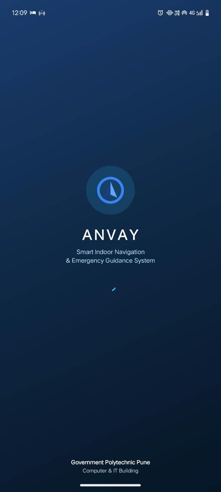
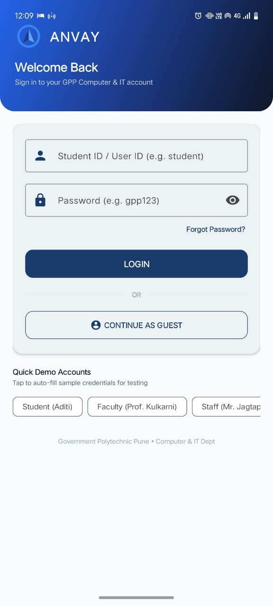
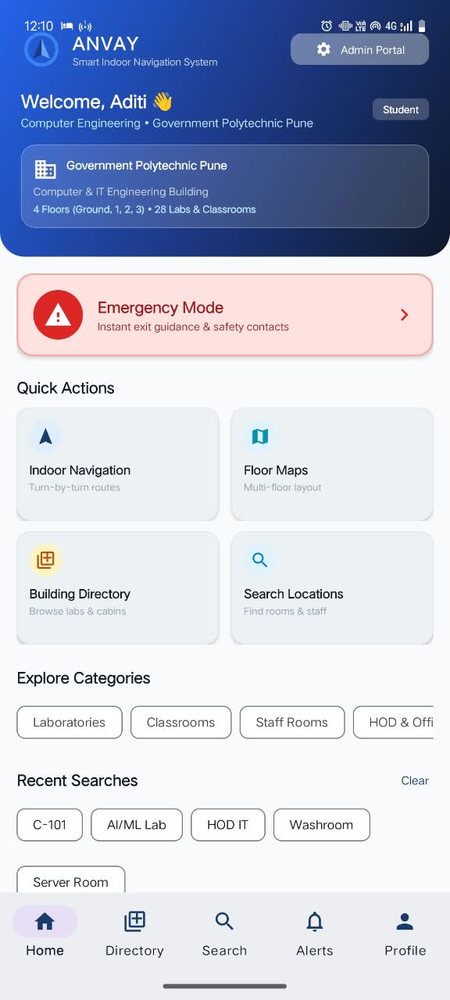
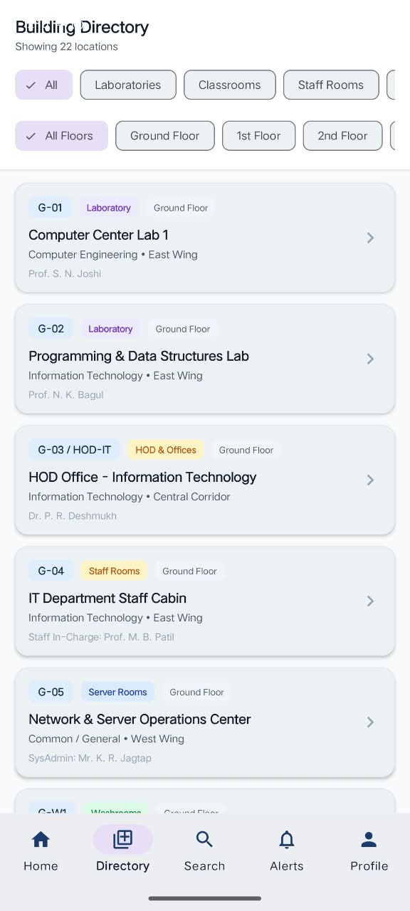
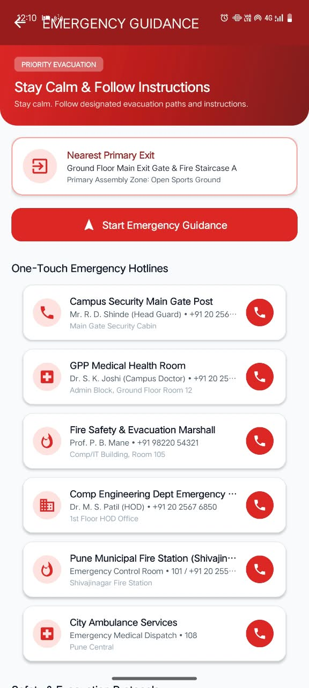
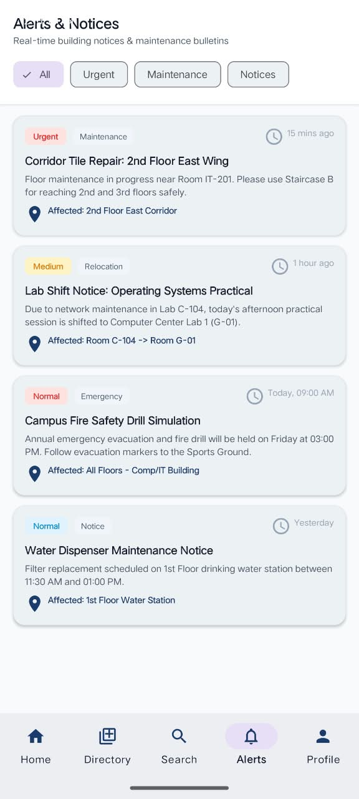
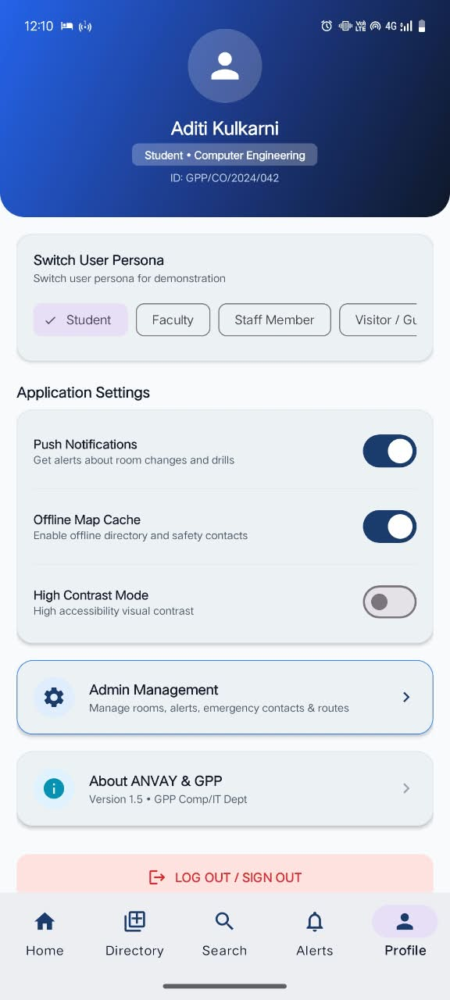

# ANVAY — Smart Indoor Navigation & Emergency Guidance System

ANVAY is an Android-based smart indoor navigation and emergency guidance system designed to help users navigate complex educational buildings efficiently and safely.

## 📌 Overview

Finding classrooms, laboratories, offices, and other facilities inside a large educational building can be difficult, especially for new students, visitors, and staff. ANVAY provides a centralized mobile application for discovering locations, navigating between floors, accessing building information, receiving alerts, viewing photo-grounded visual guidance, and obtaining emergency guidance.

## 🎯 Objective

The objective of ANVAY is to provide a simple and accessible mobile solution for:

- Finding rooms and facilities inside the building
- Navigating between different floors and locations
- Providing photo-grounded visual references and landmarks captured during real building walkthroughs
- Guiding users through verified vertical staircase transitions (S1, S2, S3)
- Guiding users during emergency situations with one-touch emergency contacts
- Delivering important building alerts and notices
- Supporting efficient access to campus facilities

## 🚀 Features

* 🔐 User authentication (Login, Sign Up, Guest Mode)
* 🔎 Search for rooms and locations
* 🗺️ Interactive floor maps
* 📍 Indoor turn-by-turn navigation
* 📸 Photo-grounded visual indoor navigation (80 verified physical building reference photos)
* 🧭 Multi-floor navigation with verified staircase transitions (S1, S2, S3)
* 📱 Augmented Reality (AR) camera overlay navigation
* 🚨 Emergency guidance with one-touch calling (101, 108, Security, Medical, Fire)
* 🔄 Route recalculation when a path is blocked
* 🏢 Building level perspective & visual 3D-style floor visualizer

## 🛠️ Tech Stack

* **Language:** Java
* **Platform:** Android
* **UI:** XML, Material Design Components
* **IDE:** Android Studio / Antigravity IDE
* **Build System:** Gradle

## 🏫 Project Scope & Verified Building Topology

The current implementation focuses on the **Computer/IT Building of Government Polytechnic Pune**, covering:

* Ground Floor
* 1st Floor
* 2nd Floor

*(Note: The building consists strictly of Ground, 1st, and 2nd Floors. No 3rd Floor exists).*

### Verified Staircase Topology
Vertical floor transitions occur through three verified staircases:
- **Staircase S1 (East Wing):** `GF-S1 ↔ FF-S1 ↔ SF-S1`
- **Staircase S2 (Central Lobby):** `GF-S2 ↔ FF-S2 ↔ SF-S2`
- **Staircase S3 (West Wing):** `GF-S3 ↔ FF-S3 ↔ SF-S3`

## 📸 Photo-Grounded Visual Navigation Experience

ANVAY introduces a photo-grounded visual navigation experience based on a physical walkthrough and photographic mapping of the Computer/IT Building.

1. **80 Locally Bundled Photographs:** High-resolution optimized visual landmarks covering room entrances (e.g., IT Labs, CR14–CR22, Admission Room, Staff Rooms), corridor junctions, and staircase landings/flights.
2. **Single Source of Truth:** Routes are generated dynamically by `NavigationGraph` and `PathFinder` (BFS algorithm). `VisualNavigationManager` resolves each step to verified visual landmarks without altering the topological graph.
3. **Floor Transition Visualization:** Explicit alerts when transitioning between floors (e.g., *"Take Staircase S3 to 2nd Floor"*), accompanied by stairwell photographs.
4. **Graceful Fallback:** If a specific waypoint has no photograph, the system automatically falls back to directional corridor guidance without breaking navigation.
5. **AR Integration:** Seamless transition to `ARNavigationActivity` with live camera feed overlays sharing the exact same `NavigationRoute`.
6. **Positioning Limitation:** For academic evaluation, the system utilizes manual/mock step progression (`Next Step`, `Previous Step`, `Restart`) through `UserPositionManager`. No unverified real-time indoor GPS/BLE positioning is fabricated.

## 📱 Application Flow

```text
Login / Guest Access
        ↓
Home Dashboard
        ↓
Search Location
        ↓
Location Details
        ↓
Standard Indoor Navigation
   ├── Start Photo-Grounded Visual Guidance (VisualNavigationActivity)
   └── Start AR Camera Overlay (ARNavigationActivity)
        ↓
Emergency Guidance
```

## 🚨 Emergency Guidance

ANVAY provides emergency guidance and safety instructions during emergencies, offering clearly visible one-touch emergency hotlines (Campus Security, Medical/First Aid, Fire, Department Desk, Ambulance 108) and guiding users through verified building staircases and corridors across Ground, 1st, and 2nd floors.

## 📂 Project Structure

```text
ANVAY/
├── app/
│   ├── src/
│   │   ├── main/
│   │   │   ├── java/com/gpp/anvay/
│   │   │   │   ├── adapter/
│   │   │   │   ├── data/
│   │   │   │   │   └── visual/
│   │   │   │   ├── model/
│   │   │   │   │   ├── position/
│   │   │   │   │   └── visual/
│   │   │   │   ├── navigation/
│   │   │   │   │   └── visual/
│   │   │   │   ├── position/
│   │   │   │   └── ui/
│   │   │   ├── res/
│   │   │   │   ├── drawable/
│   │   │   │   ├── drawable-nodpi/  (80 visual reference photos)
│   │   │   │   ├── layout/
│   │   │   │   └── values/
│   │   │   └── AndroidManifest.xml
│   │   └── test/
│   │       └── java/com/gpp/anvay/
│   │           ├── emergency/
│   │           ├── navigation/
│   │           ├── position/
│   │           └── visual/
│   └── build.gradle
├── docs/
├── build.gradle.kts
├── settings.gradle.kts
└── README.md
```

## ⚙️ Setup

### Prerequisites

* Android Studio / Antigravity IDE
* JDK 17+
* Android SDK (API 31+)
* Android device or emulator

### Run the Project

1. Clone the repository: `git clone https://github.com/Aditikalbhor/Anvay.git`
2. Open the project in Android Studio.
3. Allow Gradle to sync.
4. Run `./gradlew assembleDebug` to build the APK.
5. Connect an Android device or start an emulator and launch the app.

## 📱 Screenshots

### 🚀 Startup Screen


### 🔐 Login


### 🏠 Home Dashboard


### 📚 Building Directory


### 🚨 Emergency Guidance


### 🔔 Alerts & Notices


### 👤 Profile


## 🔮 Future Scope

* Beacon-based BLE / UWB automated positioning integration
* Expansion to other academic and administrative buildings on campus
* Advanced accessibility assistance (audio cues, high-contrast themes)

## 👩‍💻 Developer

**Aditi Kalbhor**  
Computer Engineering Student, Government Polytechnic Pune  
GitHub: [Aditikalbhor](https://github.com/Aditikalbhor)
